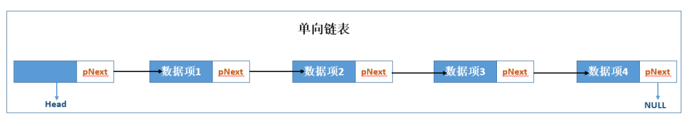
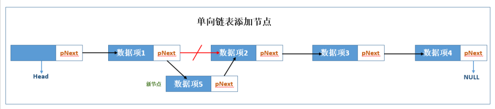
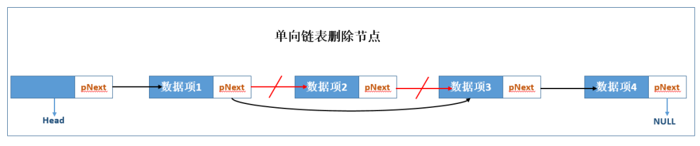
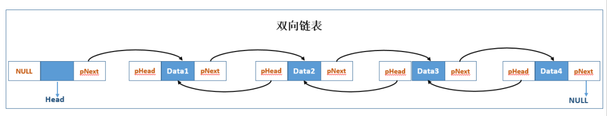
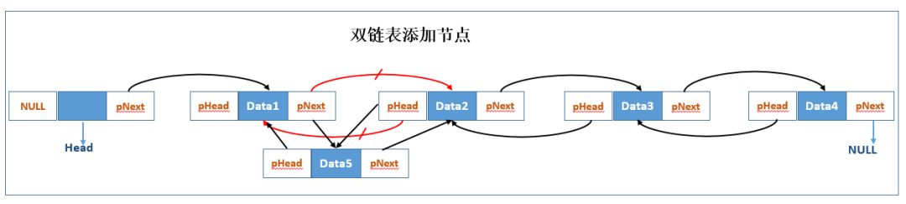
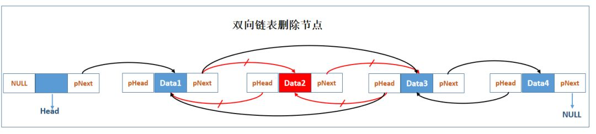

## 链表

----
### 一、简介
链表（Linked list）是一种常见的基础数据结构，是一种线性表，但是并不会按线性的顺序存储数据，而是在每一个节点里存到下一个节点的指针(Pointer)。链表通常由一连串节点组成，每个节点包含任意的实例数据（data fields）和一或两个用来指向上一个/或下一个节点的位置的链接（"links"）。

使用链表结构可以克服数组链表需要预先知道数据大小的缺点，链表结构可以充分利用计算机内存空间，实现灵活的内存动态管理。但是链表失去了数组随机读取的优点，同时链表由于增加了结点的指针域，空间开销比较大。

链表最明显的好处就是，常规数组排列关联项目的方式可能不同于这些数据项目在记忆体或磁盘上顺序，数据的访问往往要在不同的排列顺序中转换。而链表是一种自我指示数据类型，因为它包含指向另一个相同类型的数据的指针（链接）。链表允许插入和移除表上任意位置上的节点，但是不允许随机存取。链表有很多种不同的类型：单向链表，双向链表以及循环链表。


----
### 二、链表类型

#### 1、单向链表
链表的链接方向是单向的，对链表的访问要通过从头部开始，依序往下读取。单向链表的数据结构可以分为两部分：数据域和指针域，数据域存储数据，指针域指向下一个存储节点的地址。


##### 1.1 单链表结构
```
//单向链表节点数据结构
typedef struct linkNode
{
      void *val; //数据项(任意类型)
      struct linkNode *next;
}node;
```

##### 1.2 单链表插入节点操作


单向链表中由四个数据节点，数据1，数据2，数据3，数据4，现在数据1和数据2节点间插入数据5，只需把数据1节点的pNext指向新的节点，把新节点的pNext指向数据2节点即可。

##### 1.3 单链表删除节点操作


删除节点2，只需把第一个节点的pNext执行数据3节点，同时释放节点2的存储空间即可。


----
#### 2、双向链表
双向链表有别于单向的，每个节点除了数据项外有两个指针分别指向前一个节点和后一个节点，占用空间会大一些，可以实现从头到尾的遍历，又可以从尾到头遍历。

每个数据结点中都有两个指针，分别指向直接后继和直接前驱。所以，从双向链表中的任意一个结点开始，都可以很方便地访问它的前驱结点和后继结点。一般我们都构造双向循环链表。



##### 2.1 双向链表结构
```
//双向链表节点数据结构
typedef struct dLinkNode
{
      void *val; //数据项(任意类型)
      struct dLinkNode *prev;      
      struct dLinkNode *next;
}node;
```

##### 2.2 双向链表插入节点操作


节点1与节点2之间插入新节点5，需要把节点1的pNext指向节点5，节点5的pHead指向节点1，节点5的pNext指向节点2，节点2的pHead指向节点5

##### 2.3 双向链表删除节点操作


删除节点2，把节点1的pNext指向节点3，把节点3的pHead指向节点1，同时释放节点2的存储空间即可。

----
#### 3、循环链表
循环链表是一种链式存储结构，它的最后一个结点指向头结点，形成一个环。因此，从循环链表中的任何一个结点出发都能找到任何其他结点。循环链表的操作和单链表的操作基本一致，差别仅仅在于算法中的循环条件有所不同。


----
### 三、总结
- 插入、删除数据效率高，时间复杂度为O(1)级别（只需更改指针指向即可），随机访问效率低，时间复杂度O(n)级别（需要从链头至链尾进行遍历）。
- 和数组相比，内存空间消耗更大，因为每个存储数据的节点都需要额外的空间存储后继指针。

----
### 四、数组与链表的比较
- 1.插入、删除和随机访问的时间复杂度
```
数组：插入、删除的时间复杂度是O(n)，随机访问的时间复杂度是O(1)。
链表：插入、删除的时间复杂度是O(1)，随机访问的时间复杂端是O(n)。
```

- 2.数组缺点
```
1）若申请内存空间很大，比如100M，但若内存空间没有100M的连续空间时，则会申请失败，尽管内存可用空间超过100M。
2）大小固定，若存储空间不足，需进行扩容，一旦扩容就要进行数据复制，而这时非常费时的。
```

- 3.链表缺点
```
1）内存空间消耗更大，因为需要额外的空间存储指针信息。链表存储空间不连续，可以充分利用碎片空间，数组的存储空间是连续的，内存空间要求高，必须要有足够连续的内存空间。
2）对链表进行频繁的插入和删除操作，会导致频繁的内存申请和释放，容易造成内存碎片，如果是Java语言，还可能会造成频繁的GC（自动垃圾回收器）操作。链表的插入删除元素简单，无需对元素移动，但查询元素会慢，数组对元素的插入删除较复杂，同时使用时要预先指定长度，但数组的查询会很快。

```

- 4.如何选择？
```
数组简单易用，在实现上使用连续的内存空间，可以借助CPU的缓冲机制预读数组中的数据，所以访问效率更高，而链表在内存中并不是连续存储，所以对CPU缓存不友好，没办法预读。如果代码对内存的使用非常苛刻，那数组就更适合。
```
